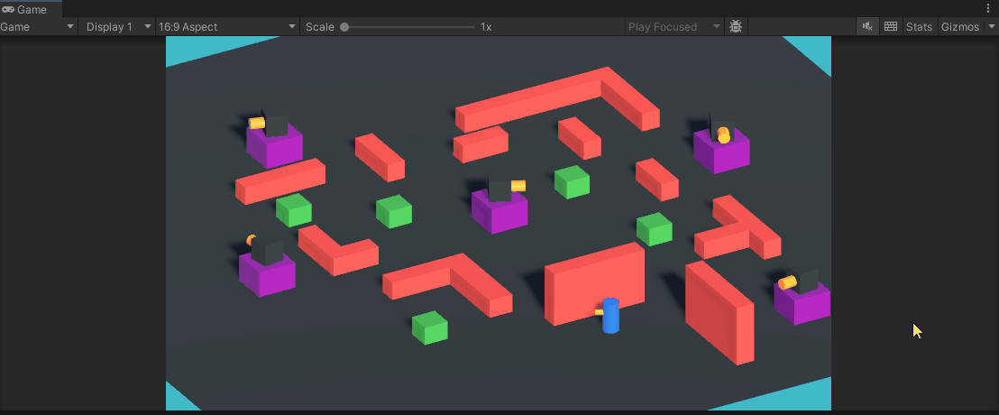
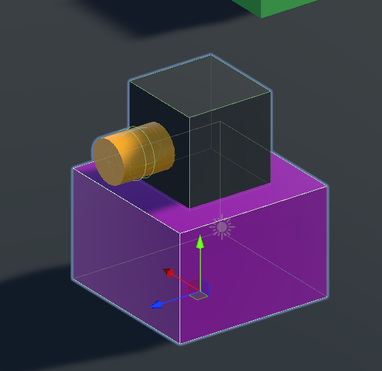
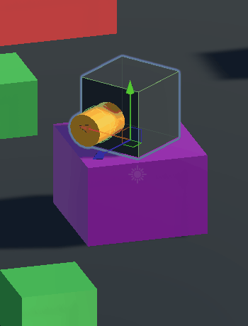
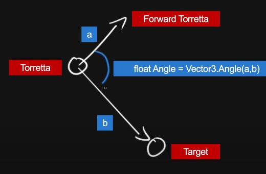
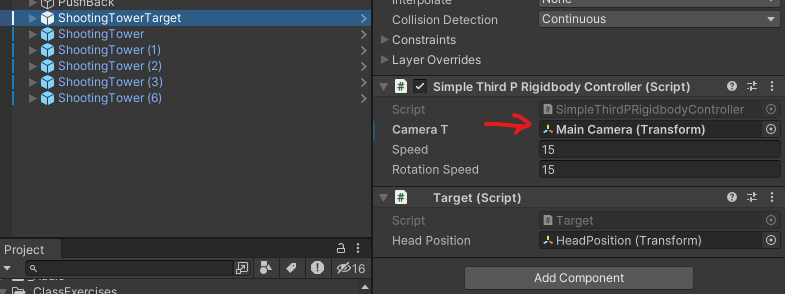
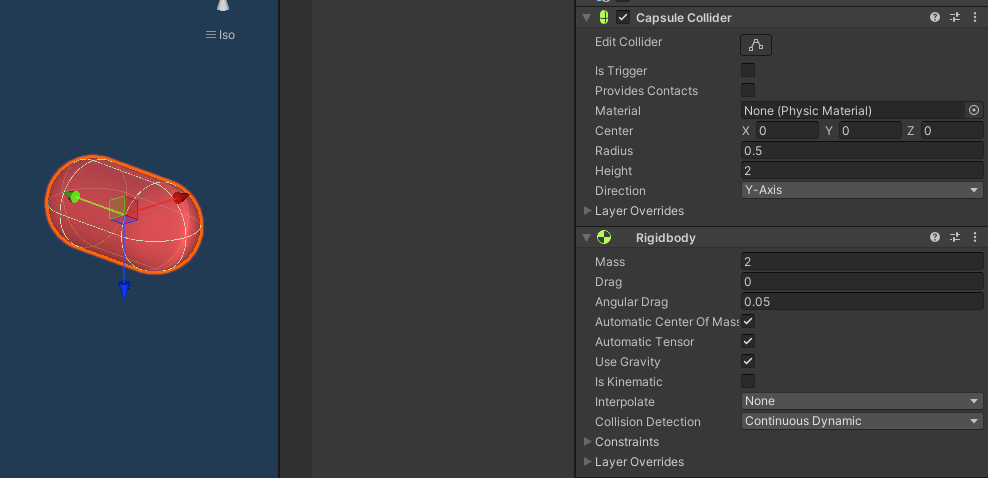
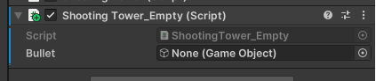
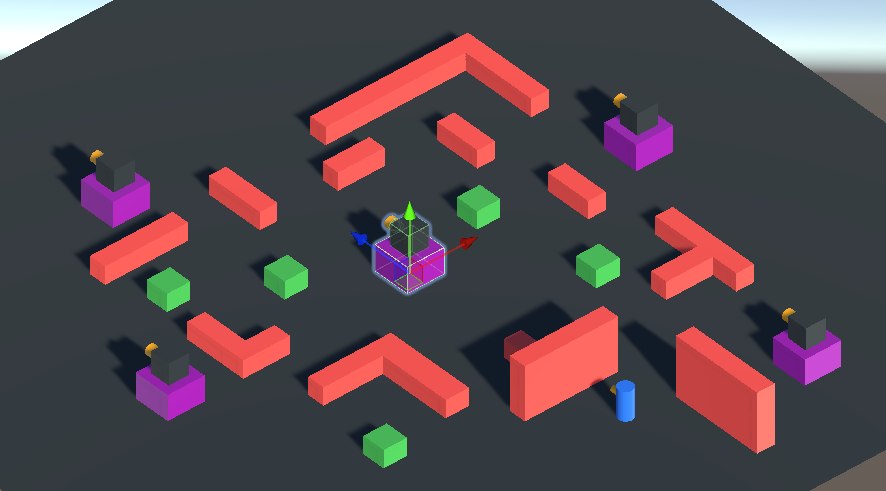

# Interactions

An introduction to the main concepts associated with scripting interactions in Unity are covered in [this](https://youtube.com/playlist?list=PLk0p6RIhmcfkfKKCWE-4T7lGyiatcqxay) YouTube playlist.

In this page you can find an overview of the [project contents](#project-material) seen in the video and an [exercise](interactions.md#Exercise) to practice the acquired knowledge. 

# Project Material

All the videos refer to scenes and scripts contained in the "Assets/\_Scripting" folder.

- [06-OnCollision](interactions.md#06-OnCollision)
- [07-OnTrigger](interactions.md#07-OnTrigger)
- [08-Raycasting](interactions.md#08-Raycasting)
- [09-EnvironmentInteraction-FP](interactions.md#09-EnvironmentInteraction-FP)

### 06-OnCollision

TBD
### 07-OnTrigger

TBD

### 08-Raycasting

TBD

### 09-EnvironmentInteraction-FP

TBD
# Exercise

The objective of this exercise is to try to reproduce the behaviour of the rotating towers you see in the scene "Assets/\_ClassExercise/ShootingTowers/ShootingTowers.unity"



Open the scene and press Play. You will be able to move the character using the WASD keys. What happens is that, as long as the character is hidden by the big red walls the rotating shooting towers do not "see" him. As soon as he exists, and falls in the line of sight of the towers, they start shooting him. 

Let's now breakdown the scene into a series of steps.

<blockquote class="callout callout_default" theme="">
<p>I suggest you create in the root folder Asset a personal folder which you can name "MyContents" inside which you will place all the objects, scenes and assets you create or modify during the exercises. This is to keep things organized and to make sure that you mods are not affected by changes I make to the project's folders structure and contents. Thus, place all your stuff in this folder.</p> </blockquote>
### 1. Tower Model

Start by creating a new scene, and placing a plane to act as a ground reference. Give it the color you want.

Using only the Unity primitives, build a block model of a shooting tower with a rotating module on top, as in the image below. A prefab of the tower is available in "Assets/\_ClassExercise/ShootingTowers/Prefabs/ShootingTower"



It is composed of a a Cube as a base (purple), then a smaller cube on top as an independent object which can move (black cube) and finally a cylinder (yellow) attached to the smaller cube. As you will be needing to rotate via scripting the entire upper part (gif below) of the object, it is important that the objects are correctly related in the hierarchy. 



If you want you can give some colored materials to the objects you created.
### 2. Tower Behaviour

To properly script the general tower behaviour lets first understand which is the high level logic. The behaviour can be broken down into:

1. The upper part of the tower continuously rotates on his upward facing axis
2. Check IF the desired target fall between a specific field of view defined by a radius and an angle
3. IF the target is inside the field of view, check if there are any obstacles between the tower and the target
4. IF there are NO obstacles, then start rotating the upper part of the tower in order to always point at the target
5. shoot at the target (next step)

As soon as the target is not any longer visible to the tower (conditions in step 2 and 3) are not met, stop shooting and rotate continuously the upper part (step 1).

The complete and commented script of the tower is available in "Assets/\_ClassExercise/ShootingTowers/Scripts/ShootingTower.cs". An "empty" version of it is present in the same folder and is named ShootingTower_Empty.cs and it simply contains the high level functions to fill out the behaviour. But you can also start from scratch by creating a new MonoBehaviour. 

Some suggestions on how to implement the main required behaviours. 

To check if the target is visible you need to pass the following 3 conditions:
1. is the target withing a given minimum "view distance"
2. is it inside the field of view of the tower, defined in angles
3. are there obstacles between the tower and the target

This can be summarized with the picture below:


Anything outside the circle (defined by a radius) is invisible to the tower (white object in the center). Only the objects within the angle can be seen. Finally, by using a ray (in the image the green lines) if the first hit IS NOT the target (green line on the left) then there is an obstacle. On the other hand if the hit object is the target (green line on the right), then it means the target is in sight with no obstacles. 

1. To check if the object falls within the minimum radius check the distance between the tower and the target
2. To check for the field of view use the [Vector3.Angle()](https://docs.unity3d.com/ScriptReference/Vector3.Angle.html) function to see if the angle between the tower forward and the target is within the boundries.



3. To check the presence of an obstacle use the [Physics.Raycast()](https://docs.unity3d.com/ScriptReference/Physics.Raycast.html) function as outlined in the [video of this topic](https://youtu.be/VOYrRVt0NBM). 

To check if everything is working, you will need to attach the script to the object you created in the previous scene. Then you will need a target. For the target you can use the prefab ShootingTowerTarget available in  "Assets/\_ClassExercise/ShootingTowers/Prefabs". Drag and drop it in the scene and make sure to assign the reference of the main camera you have in the scene.



Make sure to also add some big obstacles like walls in the scene where the target can hide. Remember that as you check for their presence using raycasts, these objects need a collider component attached. 


To verify that your tower is shooting, for the moment you can simply use a Debug.Log() function to print on the console that things are working as expected. In the next step we will model the shooting behaviour.

Now press Play and see what happens.
### 3. Tower Shooting

The shooting behaviour is achieved by creating the in the scene at runtime a Bullet object and throwing it at the target using physics functions.

The first thing you will need is a bullet prefab with a collider and rigidbody component attached to it. The bullet can be a simple capsule. Create it and drag it somewhere in your project to make it a prefab. 



For your convenience you can find it also in the "Assets/\_ClassExercise/ShootingTowers/Prefabs" folder. 

Now that you have your bullet prefab ready, you need to expose on the ShootingTower script a public variable so that you can pass the prefab you just created. So, define the variable as public. 

````csharp
public class ShootingTower_Empty : MonoBehaviour  
{  
    public GameObject bullet;
``````

Which will result in the inspector in this



Drag here the prafab you just created.

To shoot this object you now need to Instantiate it in the scene at runtime. This is achieved using the function [Instantiate()](https://docs.unity3d.com/ScriptReference/Object.Instantiate.html) which can be called from any MonoBehaviour. And you need to pass it:

1. the object you want to create. In this case, use the variable bullet which holds a reference to the prefab
2. the position and orientation where you want the object to be instantiated. Make sure that the position corresponds to the tip of the cannon of your shooting tower. To help retrieve this position you can use an empty game object child of the tower cannon. 

Once the object has been instantiated you need to shoot it at the target. We will need to retrieve the Rigidbody component attached to the instantiated object using the GetComponent() function. 

Since the Instantiate() function returns a reference to the object instantiated you can use this to retrieve the component.

````csharp
GameObject instantiatedBullet = Instantiate(bullet, /*position*/, /*rotation*/);
Rigidbody bulletRigidbody = instantiatedBullet.GetComponent<Rigidbody>();
``````

Now that you have a reference to the component, shoot it using some physics function, for example adding a force to it:

````csharp
GameObject instantiatedBullet = Instantiate(bullet, /*position*/, /*rotation*/);
Rigidbody bulletRigidbody = instantiatedBullet.GetComponent<Rigidbody>();
bulletRigidbody.AddForce(shootingDirection * _shootForce, ForceMode.Impulse);
``````

For a complete example refer to the Shoot() function implemented in the ShootingTower.cs script.
### 4. Compose the Scene

Now that you have all the components, compose the scene in order to have multiple shooting towers. The shooting tower you previously created should be a prefab, so simply drag and drop your prefab several times in the scene. Then place (if you have not done so already) the target. As mentioned before, you can use the ShootingTowerTarget prefab available in  "Assets/\_ClassExercise/ShootingTowers/Prefabs". Then place some obstacles wall and see if everything works!



