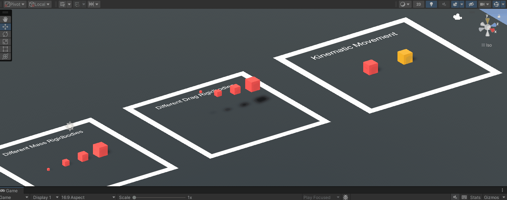
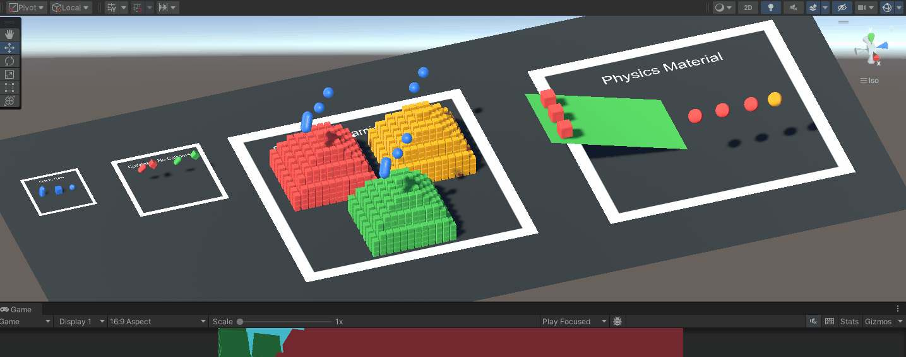
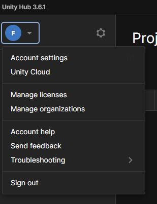
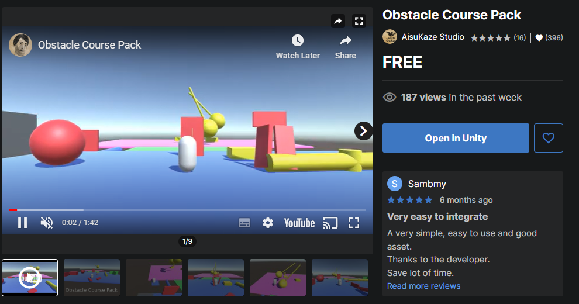
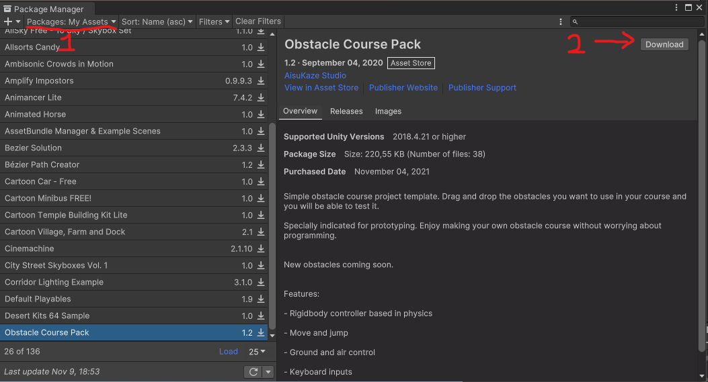
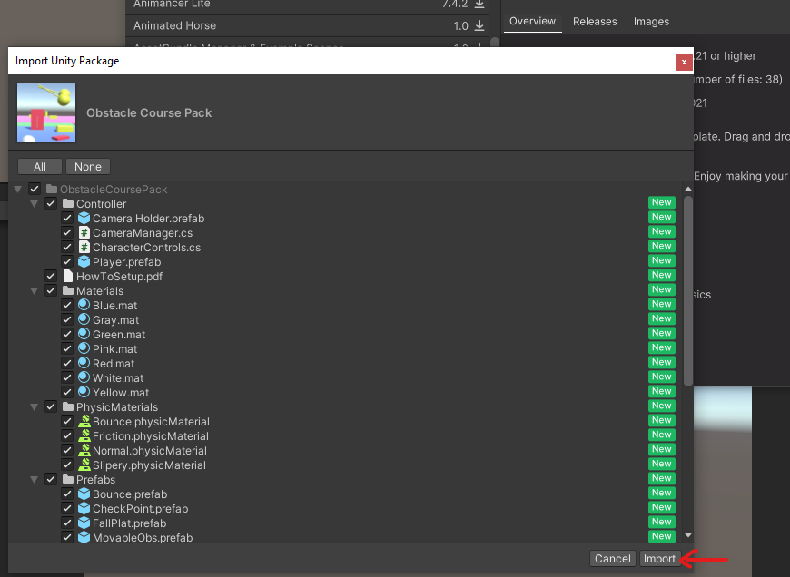
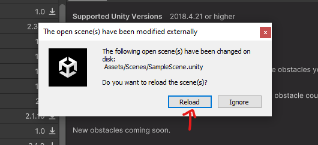
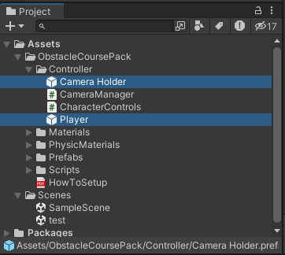
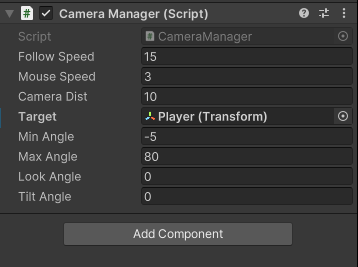

# Physics

An introduction to the main concepts associated with Physics simulations in Unity are covered in [this](https://youtube.com/playlist?list=PLk0p6RIhmcfnrVFCpKnPvYr6SZqTEiTAx) YouTube playlist.

In this page you can find an overview of the [project contents](docs/physics/physics.md#Project Material) seen in the video and an [exercise](physics.md#Exercise) to practice the acquired knowledge.
## Project Material

All the videos refer to scenes and scripts contained in the "Assets/\_Physics" folder.  

- [00-Rigidbodies](physics.md#00-Rigidbodies)
- [01-Colliders](physics.md#01-Colliders)
- [02-Joints](physics.md#02-Joints)
- [03-Explosions](physics.md#03-Explosions)
- [04-Rigidbody-Movement](physics.md#04-Rigidbody-Movement)
- [05-Collision-Matrix](physics.md#05-Collision-Matrix)

<blockquote class="callout callout_default" theme="">

Most of the scenes in the Physics collection are intended to be viewed from the <b>Scene</b> tab of the Unity Editor as the Camera is not correctly positioned. Thus, simply press play in the editor and then navigate the environment in the <b>Scene</b> view.
 </blockquote>

### 00-Rigidbodies

In this scene it is possible to see several stations (delimited by the white square perimeter) each showing a different behaviour associated with the Rigidbody component. In order, from left to right:

- **Rigidbody vs No Rigidbody**: two cubes: only the right (yellow) cube falls to the ground having a Rigidbody component attached to it.
- **Different Mass Rigidbodies**: we have cubes of different dimensions, each with a Rigidbody component, with a growing value in the mass property. The rightmost cube has the least (1) vs the rightmost which has the highest (1000). When the objects fall we see that they fall at the same speed, to show that mass does not affect the speed of fall but will be determinant when object collide (01-Colliders).
- **Different Drag Rigidbodies**: in this section, the same cubes as above, instead of having different masses, they have different drag values (from 10 to 0.001) and equal mass. In this case the falling behaviour changes as their speed falling to the ground is affected as it happens in reality where drag with the atmosphere makes objects fall at different speeds.
- **Kinematic Movement**: for this area, activate the **Game** and click on it to enable input reading. Once the objects are on the ground you can press the **space bar** to move the cubes upwards. You will see different behaviours as the two cubes translation is performed differently. They are both moved by changing the transform.position value, but the red cube is not setted as Kinematic when the translation is applied, thus causing a conflict between the Physics and regular Update loops. Thus, it is important to remember that **if a rigidbody position will be controlled not from the physics simulation, IT MUST BE SETTED AS KINEMATIC.** 

### 01-Colliders

As in the

### 02-Joints

WIP
### 03-Explosions

WIP
### 04-Rigidbody-Movement

WIP
### 05-Collision-Matrix

WIP
## Exercise

The exercise for the physics topic consists in trying to reproduce a scene composed of several obstacles whose behaviour is physics based. In few words you should try to achieve something as displayed in [this video](https://www.youtube.com/watch?v=5-58sG5vy8g).

The video is an extract of the package **Obstacle Course Pack** which can be downloaded from the Unity Asset Store at [this link](https://assetstore.unity.com/packages/templates/packs/obstacle-course-pack-178169?aid=1011lGbg&pubref=am&utm_source=aff#content)

The steps to complete the exercise are the following:
 
1. [Download and Install the Asset](<physics#Step 1 Download and Install the Asset>)
2. [Tryout the example scene](<physics#Step 2 Tryout the example scene>)
3. [Try to reproduce some (or all) of the obstacles shown in the example scene](<physics#Step 3 Reproduce It!>)

### Step 1: Download and Install the Asset

Open the Unity Hub and make sure that you are logged in with your Unity account.

Then create a new empty Unity project with the latest version of Unity you downloaded. Give it the name you prefer.

Once the Unity project is open (N.B. do not close it), go to the asset web page on the Unity Asset Store, [this](https://assetstore.unity.com/packages/templates/packs/obstacle-course-pack-178169?aid=1011lGbg&pubref=am&utm_source=aff#content) is the link.
From there make sure you are correctly logged with the same account you previously logged into the Unity Hub. 

Now you can add the Asset to your list of assets by pressing the big blue button right next to the asset name, it should look something like this:

Right after adding the asset (or if you have already added it) you will see a button saying: "Open in Unity", as below:

Click the button and the asset will be made available in the Unity project you just created (which was open in the background).

This action will open the **Package Manager** in the Editor adding the asset to the list of your **My Assets** (1). Now Download the asset by pressing the **Download** button (2) and then click **Import** (same button).

In the editor you will be prompt to review the contents of the package and by pressing the **Import** button, the asset will be included in the project.

Finally, if asked to reload the sample scene, click **Reload**

This happens because the downloaded asset contain a scene called SampleScene contained in a Scenes folder. By adding the asset you are overwriting the existing sample scene and that is why Unity is asking if you wish to reload, because the scene has changed.
### Step 2: Tryout the example scene

If the scene does not open automatically, open it from the Project tab, it is under:/Scenes/SampleScene.unity. Once opened, click play and mess around. 

You can move using the WASD keys and orient the camera using the mouse.

Move around the entire scene and try out all the obstacles available in the scene. Based on your knowledge of the behaviour of the Unity Physics' engine, try to speculate how the objects behaviours were created.

<blockquote class="callout callout_default" theme="">

If your cursor disappears after pressing Play, don't panic. Simply press the <b>Escape Key</b> and the cursor will appear again!</blockquote>

If you want an explanation of the different obstacles, in the "Assets/ObstacleCoursePack" folder there is a pdf file named HowToSetup which explains them.

### Step 3: Reproduce it!

Now it is your turn, the objective should be to try to recreate a piece at a time the various obstacles present in the sample scene. To do so you will need to:

#### Create a new Scene

Create a new scene and give it a name. Delete the Main Camera object present in the scene as you will add a new one later. Add a plane where the character can move.

#### Add and Set the Character Controller

To move in the scene you can use the third person controller prefab which came with the ObstacleCoursePack. To set it up:

- drag in the scene the **Camera Holder** and **Player** prefabs into the scene

- One scripts on each prefab need references to be set. Select the Player GameObject in the scene and in the inspector on the CharacterControls component and assign to the Cam property the Camera Holder game object in the scene.

- Now select the Camera Holder game object and in the CameraManager component assign the Player game object to the Target property.

Make sure the character is placed on the plane you previously created, press play and move around!
#### Create the Obstacles

Now try to (re)create in your scene several obstacles which you tried in the ObstacleCoursePack sample scene.   