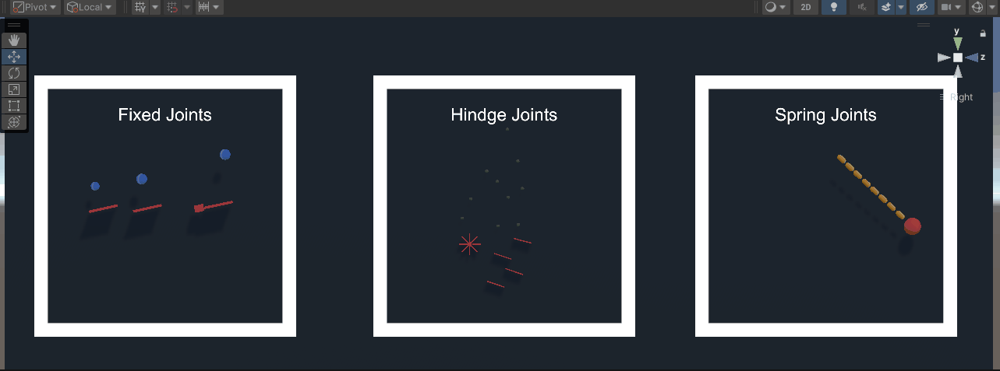
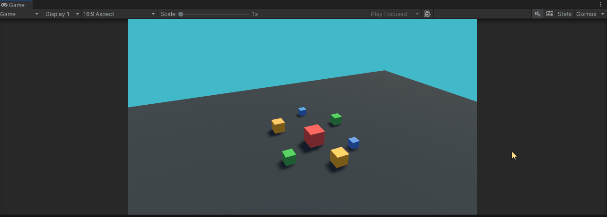
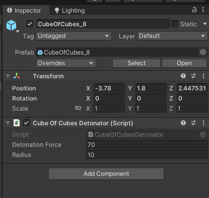
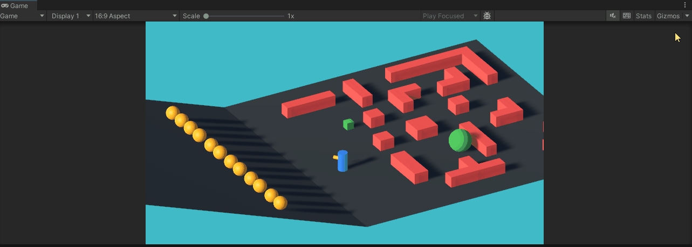
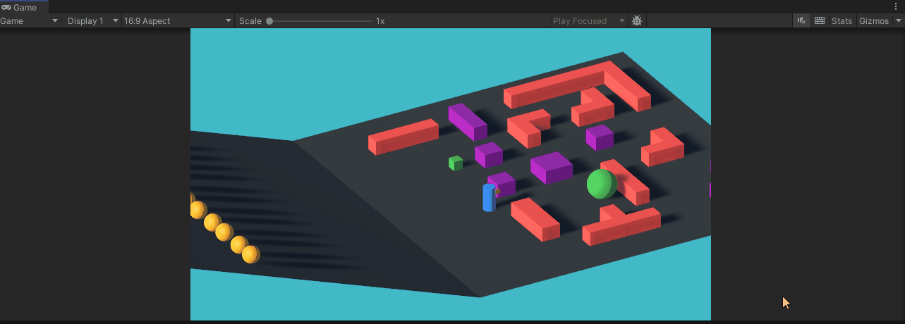
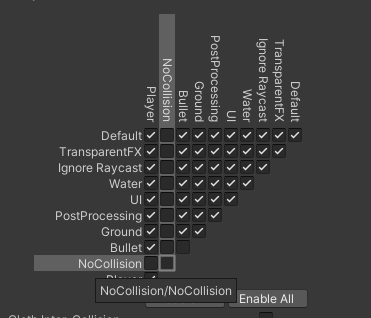

# Physics

An introduction to the main concepts associated with Physics simulations in Unity are covered in [this](https://youtube.com/playlist?list=PLk0p6RIhmcfnrVFCpKnPvYr6SZqTEiTAx) YouTube playlist.

In this page you can find an overview of the [project contents](docs/physics/physics.md#Project Material) seen in the video and an [exercise](physics.md#Exercise) to practice the acquired knowledge. 
## Project Material

All the videos refer to scenes and scripts contained in the "Assets/\_Physics" folder.  

- [00-Rigidbodies](physics.md#00-Rigidbodies)
- [01-Colliders](physics.md#01-Colliders)
- [02-Joints](physics.md#02-Joints)
- [03-Explosions](physics.md#03-Explosions)
- [04-Rigidbody-Movement](physics.md#04-Rigidbody-Movement)
- [05-Collision-Matrix](physics.md#05-Collision-Matrix)

<blockquote class="callout callout_default" theme="">
<p>Most of the scenes in the Physics collection are intended to be viewed from the <b>Scene</b> tab of the Unity Editor as the Camera is not correctly positioned. Thus, simply press play in the editor and then navigate the environment in the <b>Scene</b> view.</p> </blockquote>

### 00-Rigidbodies


In this scene it is possible to see several stations (delimited by the white square perimeter) each showing a different behaviour associated with the Rigidbody component. In order, from left to right:

- **Rigidbody vs No Rigidbody**: two cubes: only the right (yellow) cube falls to the ground having a Rigidbody component attached to it.
- **Different Mass Rigidbodies**: we have cubes of different dimensions, each with a Rigidbody component, with a growing value in the mass property. The rightmost cube has the least (1) vs the rightmost which has the highest (1000). When the objects fall we see that they fall at the same speed, to show that mass does not affect the speed of fall but will be determinant when object collide (01-Colliders).
- **Different Drag Rigidbodies**: in this section, the same cubes as above, instead of having different masses, they have different drag values (from 10 to 0.001) and equal mass. In this case the falling behaviour changes as their speed falling to the ground is affected as it happens in reality where drag with the atmosphere makes objects fall at different speeds.
- **Kinematic Movement**: for this area, activate the **Game** and click on it to enable input reading. Once the objects are on the ground you can press the **space bar** to move the cubes upwards. You will see different behaviours as the two cubes translation is performed differently. They are both moved by changing the transform.position value, but the red cube is not setted as Kinematic when the translation is applied, thus causing a conflict between the Physics and regular Update loops. Thus, it is important to remember that **if a rigidbody position will be controlled not from the physics simulation, IT MUST BE SETTED AS KINEMATIC.** 

### 01-Colliders


As a general reference to the concepts associated with physics simulation and collisions, give a read to the Unity Manual [page](https://docs.unity3d.com/Manual/CollidersOverview.html).

As in the previous scene, this contains a series of "areas" displaying different features of the Unity colliders. Once you click Play, navigate the environment from the Scene view, from left to right:

- **Collider Types**: this shows the different type of collider which can be assigned on any given Game Object. For further details refer to the the Unity Manual Page for [Capsule](https://docs.unity3d.com/Manual/class-CapsuleCollider.html), [Box](https://docs.unity3d.com/Manual/class-BoxCollider.html) and [Sphere](https://docs.unity3d.com/Manual/class-SphereCollider.html).
- **Colliders vs No Colliders**: this box simply shows the difference of having or not having a collider component attached to a Game Object whith a Rigidbody component.
- **Static vs Dynamic Collider**: here we display the different reaction to collision based on the interaction between Colliders and Rigidbodies. The red pyramid shows how the blue falling objects which have a *higher* mass assigned to the Rigidbody will destroy the structure, "moving" the red cubes. Contrarily, in the green pyramid, the falling objects have a *smaller* mass compared to the green cubes. Resulting in a collision forces which do not displace the green cubes from their original position. Finally, the yellow pyramid displays cubes with ONLY a collider and NO rigidbody (also named [Static Colliders](https://docs.unity3d.com/Manual/CollidersOverview.html#:~:text=compound%20primitive%20colliders.-,Static%20colliders,-You%20can%20add)). Here we can see that the green cubes remain in their position as well as the falling spheres, this is because no collision force is generated when the colliders are static (only collider and no rigidbody).
- **Physics Materials**: this scene simply shows the different behaviours associated to colliders when a specific Physics Material is assigned to them. For details on the Physics Material check the [manual](https://docs.unity3d.com/Manual/class-PhysicMaterial.html). In general, the objects sliding on the green platform show the behaviour of different friction properties, whereas the red sphere show the effects of the bounciness property of the assigned physics material. 

### 02-Joints



Here we display the behaviours of the different [Joints](https://docs.unity3d.com/Manual/Joints.html) available in Unity. From left to right we see [Fixed Joints](https://docs.unity3d.com/Manual/class-FixedJoint.html), [Hindge Joints](https://docs.unity3d.com/Manual/class-HingeJoint.html)and [Spring Joints](https://docs.unity3d.com/Manual/class-SpringJoint.html). For further details on the scene refer to the associated YouTube [video](https://youtu.be/zqEQGy88Ftw).  
### 03-Explosions



This scene shows how Rigidbodies can be controlled via scripting using the functions available in the [Rigidbody class](https://docs.unity3d.com/ScriptReference/Rigidbody.html). To run the scene, press Play, make sure to gain input control by pressing with the cursor inside the Game window and **press Spacebar**. You will see an explosion of cubes!

This is achieved through the CubeOfCubesDetonators.cs script (available in \_Physics/Scripts folder) attached to the different CubeOfCubes prefab.



The script get a reference to all child Rigidbodies and then when the Spacebar key is pressed it invokes the custom method Detonate:

````csharp
private void Detonate()  
{  
    for (int i = 0; i < _rigidbodies.Length; i++)  
    {   _rigidbodies[i].isKinematic = false;  
        _rigidbodies[i].AddExplosionForce(DetonationForce, transform.position, Radius);
	}
}
````

By cycling through each Rigidbody reference, it sets it to isKinematic = false to ensure that its movement will be driven by the Physics simulation and then applies an explosive force using the method [AddExplosionForce](https://docs.unity3d.com/ScriptReference/Rigidbody.AddExplosionForce.html). The method receives as input: (1) a value for the force to be applied (DetonationForce variable), (2) a position identifying the center of the sphere within which the explosion has its effect (transform.position, i.e., the center of the cube) and (3) the the radius of the sphere within which the explosion has its effect (Radius variable)
### 04-Rigidbody-Movement



This scene demonstrates how Rigidbody components can be moved (using the appropriate methods) to control a "physics sensitive" character controller which in the scene is the GameObject named "RigidBody_ThirdPersonMovement". Generally speaking, the controller moves using the function [Rigidbody.Move()](https://docs.unity3d.com/ScriptReference/Rigidbody.Move.html). 

Press Play and move the character controller using the WASD keys.

You can compare another character controller by activating in the hierarchy the game object "CharacterController_ThirdPersonMovement". You can control it using the same keys as before. 

This controller moves using the [CharacterController](https://docs.unity3d.com/Manual/class-CharacterController.html) component which is mainly used for third-person or first-person player control that does not make use of Rigidbody physics.
### 05-Collision-Matrix



This scene is the same as the previous but the purple cubes are assigned to a specific [Layer](https://docs.unity3d.com/Manual/Layers.html) named *NoCollision* which prevents objects to collide with them. This is achieved by setting the [**collision matrix**](https://docs.unity3d.com/Manual/LayerBasedCollision.html) which can be accessed in the Unity menu bar, go to **Edit** > **Project Settings**, then select the **Physics** category to open the [Physics](https://docs.unity3d.com/Manual/class-PhysicsManager.html) window. From there scroll down and you can select which layers on the Collision Matrix will interact with the other layers by checking them.


## Exercise

The exercise for the physics topic consists in trying to reproduce a scene composed of several obstacles whose behaviour is physics based. In few words you should try to achieve something as displayed in [this video](https://www.youtube.com/watch?v=5-58sG5vy8g).

The video is an extract of the package **Obstacle Course Pack** which can be downloaded from the Unity Asset Store at [this link](https://assetstore.unity.com/packages/templates/packs/obstacle-course-pack-178169?aid=1011lGbg&pubref=am&utm_source=aff#content)

The steps to complete the exercise are the following:
 
1. [Download and Install the Asset](#step-1-download-and-install-the-asset)
2. [Tryout the example scene](#step-2-tryout-the-example-scene)
3. [Try to reproduce some (or all) of the obstacles shown in the example scene](#step-3-reproduce-it)

### Step 1: Download and Install the Asset

Open the Unity Hub and make sure that you are logged in with your Unity account.


Then create a new empty Unity project with the latest version of Unity you downloaded. Give it the name you prefer.

Once the Unity project is open (N.B. do not close it), go to the asset web page on the Unity Asset Store, [this](https://assetstore.unity.com/packages/templates/packs/obstacle-course-pack-178169?aid=1011lGbg&pubref=am&utm_source=aff#content) is the link.
From there make sure you are correctly logged with the same account you previously logged into the Unity Hub. 

Now you can add the Asset to your list of assets by pressing the big blue button right next to the asset name, it should look something like this:


Right after adding the asset (or if you have already added it) you will see a button saying: "Open in Unity", as below:


Click the button and the asset will be made available in the Unity project you just created (which was open in the background).

This action will open the **Package Manager** in the Editor adding the asset to the list of your **My Assets** (1). Now Download the asset by pressing the **Download** button (2) and then click **Import** (same button).


In the editor you will be prompt to review the contents of the package and by pressing the **Import** button, the asset will be included in the project.


Finally, if asked to reload the sample scene, click **Reload**


This happens because the downloaded asset contain a scene called SampleScene contained in a Scenes folder. By adding the asset you are overwriting the existing sample scene and that is why Unity is asking if you wish to reload, because the scene has changed.
### Step 2: Tryout the example scene

If the scene does not open automatically, open it from the Project tab, it is under:/Scenes/SampleScene.unity. Once opened, click play and mess around. 

You can move using the WASD keys and orient the camera using the mouse.


Move around the entire scene and try out all the obstacles available in the scene. Based on your knowledge of the behaviour of the Unity Physics' engine, try to speculate how the objects behaviours were created.

<blockquote class="callout callout_default" theme="">
<p>If your cursor disappears after pressing Play, don't panic. Simply press the <b>Escape Key</b> and the cursor will appear again!</blockquote>

If you want an explanation of the different obstacles, in the "Assets/ObstacleCoursePack" folder there is a pdf file named HowToSetup which explains them.

### Step 3: Reproduce it!

Now it is your turn, the objective should be to try to recreate a piece at a time the various obstacles present in the sample scene. To do so you will need to:

#### Create a new Scene

Create a new scene and give it a name. Delete the Main Camera object present in the scene as you will add a new one later. Add a plane where the character can move.

#### Add and Set the Character Controller

To move in the scene you can use the third person controller prefab which came with the ObstacleCoursePack. To set it up:

- drag in the scene the **Camera Holder** and **Player** prefabs into the scene


- One scripts on each prefab need references to be set. Select the Player GameObject in the scene and in the inspector on the CharacterControls component and assign to the Cam property the Camera Holder game object in the scene.


- Now select the Camera Holder game object and in the CameraManager component assign the Player game object to the Target property.


Make sure the character is placed on the plane you previously created, press play and move around!
#### Create the Obstacles

Now try to (re)create in your scene several obstacles which you tried in the ObstacleCoursePack sample scene.   
