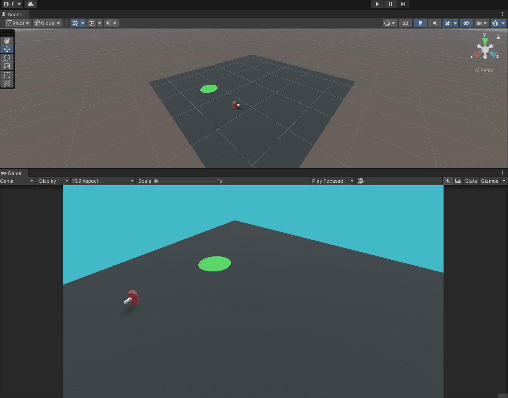
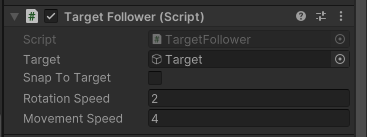
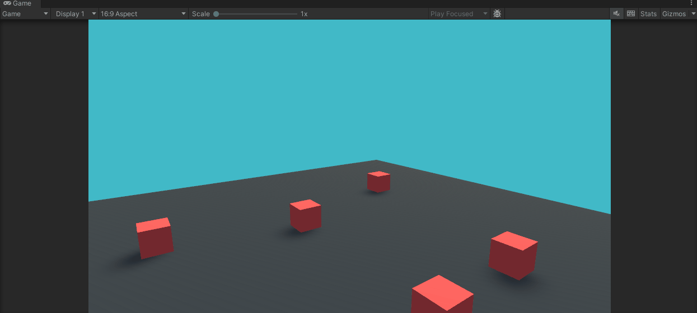
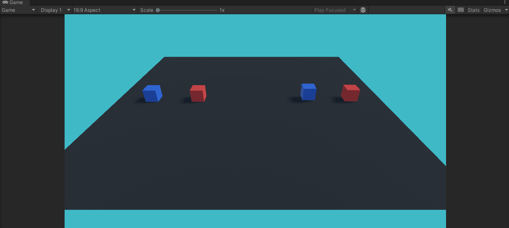
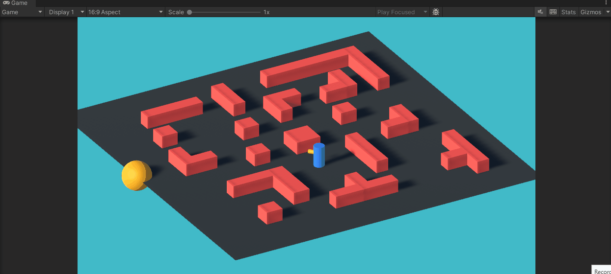
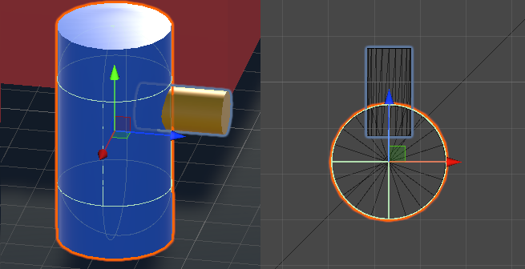

# Scripting

An introduction to the main concepts associated with Scripting are covered in [this](https://youtube.com/playlist?list=PLk0p6RIhmcflK_474ACvIo4MsL6yl-09b) YouTube playlist.

In this page you can find an overview of the [project contents](docs/scripting/scripting.md#Project Material) seen in the video and an [exercise](scripting.md#Exercise) to practice the acquired knowledge.
## Project Material

All the videos refer to scenes and scripts contained in the "Assets/_Scripting" folder.  

- [00-Callbacks-Debug](scripting.md#00-Callbacks-Debug)
- [01-TargetFollower](scripting.md#01-TargetFollower)
- [02-DeltaTime](scripting.md#02-DeltaTime)
- [03-Keyboard-GetKey](scripting.md#03-Keyboard-GetKey)
- [04-KeyBoard-Input-Movement](scripting.md#04-KeyBoard-Input-Movement)
- [05-Camera-Independent-Movement](scripting.md#05-Camera-Independent-Movement)
### 00-Callbacks-Debug

This scene simply contains a red cube with a script attached to it that prints to the editor console, using the Debug.Log(), the different [Unity callbacks](https://docs.unity3d.com/Manual/ExecutionOrder.html).  

An even more detailed description on the execution order of Unity callbacks can be found in [this Unity thread](https://forum.unity.com/threads/a-comprehensive-guide-to-the-execution-order-of-unity-event-functions.1381647/)
### 01-TargetFollower



This scene shows a following behaviour scripted in the file, *TargetFollowe.cs*. The MonoBehaviour collects the referenced object from the Target property in the script and then follows rotating and moving with according to the other properties of the script.



### 02-DeltaTime

This scene simply sows the importance of using the property [Time.deltaTime](https://docs.unity3d.com/ScriptReference/Time-deltaTime.html)when moving objects during runtime. The proper usage of this property ensures to have an application which is not frame-dependant (i.e., the objects' behaviour is not affected by the framerate the application is capable to run on a given hardware). 

A further explanation of this concept, and other examples are detailed also in [this](https://docs.unity3d.com/Manual/TimeFrameManagement.html) Unity manual page.

### 03-Keyboard-GetKey



This scene shows how to use the [Input](https://docs.unity3d.com/ScriptReference/Input.html) class and specifically the [GetKey()](https://docs.unity3d.com/ScriptReference/Input.GetKey.html) function to detect input from the keyboard and act accordingly. In this action the example is very simple: the color of each cube is randomly assigned, using the [Random](https://docs.unity3d.com/ScriptReference/Random.html) class:

````csharp
private Color[] _colors = new[] {Color.red, Color.blue, Color.green, Color.magenta, Color.white, Color.cyan, Color.yellow, Color.black};

private void ChangeColor()  
{  
    if(_renderer == null)  
        return;  
    _renderer.material.color = _colors[Random.Range(0, _colors.Length)];  
}

``````

### 04-KeyBoard-Input-Movement



This scene demonstrates how to read directional input from either WASD or arrow keys. The cubes on the left have their movement continuously updated in order to maintain changes. The cubes on the right are translated from their original starting position based on the input read either through Input.GetKey() or Input.GetAxis(). This is to show how the input read through the first method is simply a boolean which can be either true or false. On the contrary, using the GetAxis() method the read input gradually increases and decreases from one of the extremes -1 or 1 to the rest value of 0.    

Further details on the GetAxis() function can be found in the [documentation page](https://docs.unity3d.com/ScriptReference/Input.GetAxis.html) or in [this](https://www.youtube.com/watch?v=MK4OmsViqMA) YouTube video.  

### 05-Camera-Independent-Movement

TBD
## Exercise

The objective of the exercise is to recreate the scene which can be found in **"\_ClassExercise/ThirdPersonController/ThirdPersonController"**. It implements a simple ThridPersonController behaviour which controls the character using the WASD keyboard input. The position of the yellow sphere is randomly assigned at startup and whenever the character reaches it a new random position is assigned. 



I suggest you try to build it from scratch limiting the times you look at the completed scripts, but if you get stuck, give a glimpse to the functioning script.

Let's now breakdown the final output in a sequence of steps.

### 1. Environment Setup

The first thing to do is create an environment in which the character can move. You will need:
- a plane on top of which the character can move

- a game object representing a character, in the example this is achieved simply with an empty containing two cylinders. **The Yellow cylinder is aligned with the empty Forward vector.**



- some obstacles to make the movement more challenging. In the example scene they are created using simple cubes combined together.

- a game object, for example a sphere, representing the target to reach

- a camera to render everything

To simplify your work, and focus more on the scripting side of things, in the same folder you can find a scene called "", which contains all the required GameObjects but with no scripts attached.
### 2. Random Target Positioning

The script on the target should control two main behaviours: 
- random positioning on the plane the object
- check if the player has reached the target and then reposition

Lets start with the first behaviour. Create a script, or use the TargetReacher_Empty.cs and in the Start function write the code to position the game object somewhere randomly on the plane. Do this by assigning a new Vector3 to the [transform.position](https://docs.unity3d.com/ScriptReference/Transform-position.html) property. Use the Random function [Range](https://docs.unity3d.com/ScriptReference/Random.Range.html) to generate random values.

Attach the script to the correct game object, press Play and see if the random positioning works as expected. 
### 3. Character Movement

To handle the character movement you need a new script, so create one, or use SimpleThirdPersonController_Empty.cs and first define the necessary variables. Which are:

- a reference to the main camera
- a rotation speed
- a movement speed

During the update cycle what you need to do is: 

- Get the Input using Input.GetAxis() & assign the values to a new direction Vector3
- Align the direction According to Camera Orientation (use function [TransformDirection](https://docs.unity3d.com/ScriptReference/Transform.TransformDirection.html))
- Calculate the new direction vector between the current forward and the target direction calculated previously. To calculate it use the [Vector3.RotateTowards()](https://docs.unity3d.com/ScriptReference/Vector3.RotateTowards.html) method.
- Rotate the object based on the rotation value calculated in the previous step. To rotate you can use [Quaternion.LookRotation()](https://docs.unity3d.com/ScriptReference/Quaternion.LookRotation.html) function.
- Move along the transform forward vector using the [transform.Translate()](https://docs.unity3d.com/ScriptReference/Transform.Translate.html) method

Attach the script to the character game object, press Play and control it.

If some steps of the process are not clear, refer to the SimpleThirdPersonController.cs already working script.
### 4. Target Reach Detection

Now the last step. We need the target to verify if the has reached a minimum distance in order to reposition somewhere else. To do so:

- make sure that the TargetReacher script (step 2) has a reference to the character
- during the update cycle, calculate the distance between the character and the target. To do this, use the function [Vector3.Distance()](https://docs.unity3d.com/ScriptReference/Vector3.Distance.html)
- check if the values is smaller than a minimum value. This value can be made as a class variable
- if smaller, reposition the object in a new random position, as you did in step 2.


